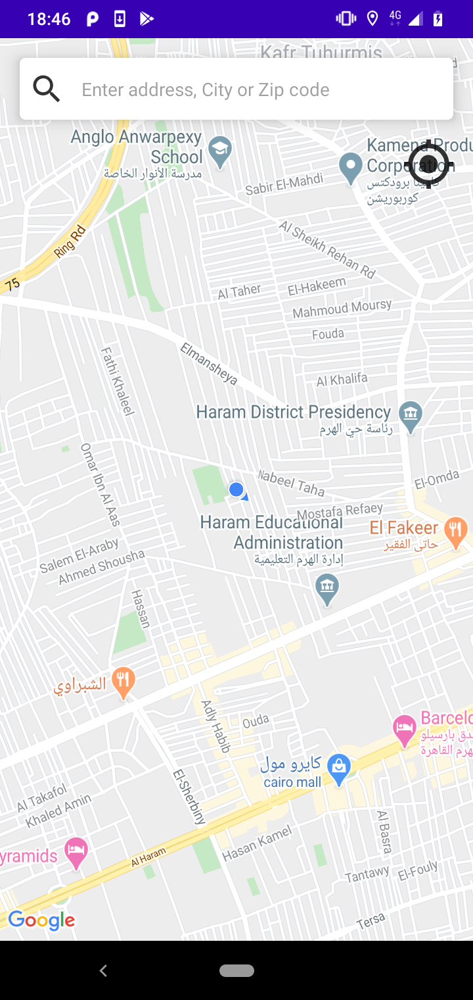
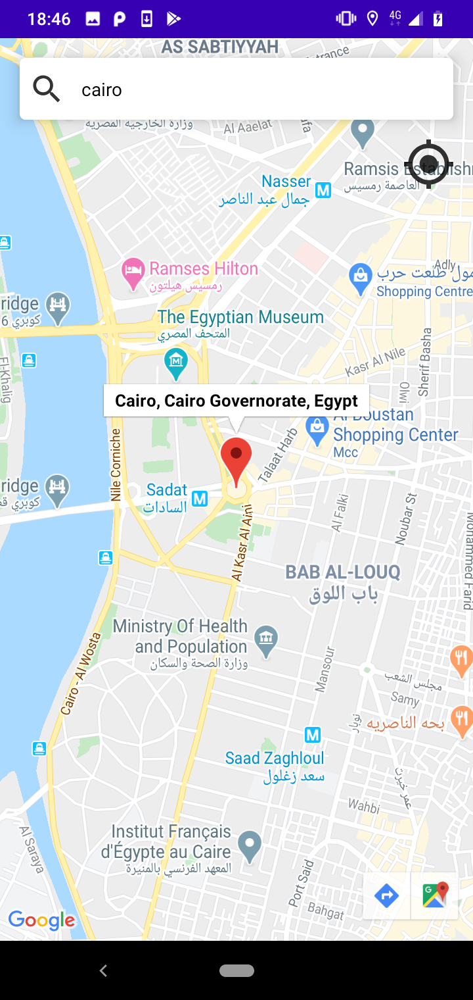

# Maps Demo App

Learn to build an Android application that leverages two powerful mapping API's: Google Maps API

# Tools

- ConstraintLayout
- drawable Xml Shapes
- Google Maps API

# Images
                  

# Author

Created by Mohamed Sobhy on 2020. Copyright © 2020 Mohamed Sobhy. [LinkedIn](https://www.linkedin.com/in/mohamed-sobhy-040958181/)

# Environment

This project was generated by Android Studio 4.0.0 and Java 

# Further Help

To get more help on the project, you can contact with me by email address m7md.sob7y20@gmail.com

# Note

This project created on 2020, some libraries or code might be depreciated.
